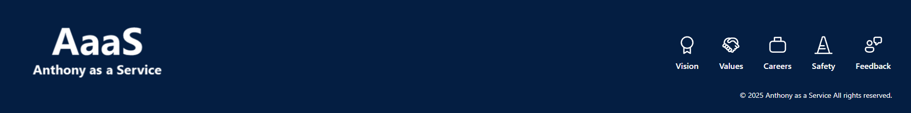
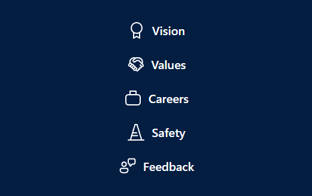

# footer

## Summary

Demonstrates how you can create a custom footer for your site and add it to the bottom of the page. **This extension will not attach it to the bottom placeholder but rather append it to the page.**

Screen width > 640px:  

Screen width < 640px:  

## Used SharePoint Framework Version

## Applies to

- [SharePoint Framework](https://aka.ms/spfx)
- [Microsoft 365 tenant](https://docs.microsoft.com/en-us/sharepoint/dev/spfx/set-up-your-developer-tenant)

## Prerequisites

The solution depends on an associated list to hold the links for the footer. There is a PowerShell script that will create the list and associated schema needed for the solution.

## Solution

| Solution | Author(s)                                                                                                   |
| -------- | ----------------------------------------------------------------------------------------------------------- |
| footer   | [Anthony Poulin](https://anthonyepoulin.com) follow me on Twitter [@ynot3363](https://twitter.com/ynot3363) |

## Version history

| Version | Date              | Comments                                    |
| ------- | ----------------- | ------------------------------------------- |
| 1.0.2   | August 23, 2025   | Updated to leverage observer pattern and UI |
| 1.0.1   | December 19, 2024 | Upgraded to 1.20.0, fixed loading issues    |
| 1.0.0   | April 15, 2022    | Initial release                             |

## Disclaimer

**THIS CODE IS PROVIDED _AS IS_ WITHOUT WARRANTY OF ANY KIND, EITHER EXPRESS OR IMPLIED, INCLUDING ANY IMPLIED WARRANTIES OF FITNESS FOR A PARTICULAR PURPOSE, MERCHANTABILITY, OR NON-INFRINGEMENT.**

---

## Minimal Path to Awesome

- Clone this repository
- Ensure that you are at the solution folder
- in the command-line run:
  - **npm install**
- Update and Run the CreateList.ps1 PowerShell script to create the associated list schema
- Update the properties in the following files to match your env.
  - config > serve.json
  - sharepoint > assets > ClientSideInstance.xml
  - sharepoint > assets > elements.xml

## Features

The **footer** extension will apply a footer element to the bottom of the page by appending it to SharePoint pages. This will provide the user the ability to scroll to the footer versus it being sticky at the bottom of the page.

This extension illustrates the following concepts:

- Append elements to a SharePoint page outside designated areas
- Creating a custom footer
