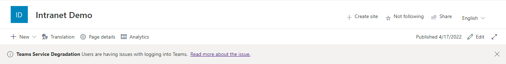
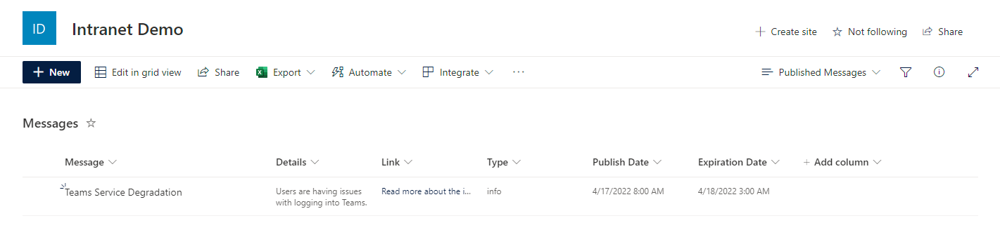

# messages extension

## Summary

Demonstrates how you can a fix messages, or alerts, to the top of every page within SharePoint.This extension **will not** attach it to the header section but rather prepend it to the page.

**Messages Extension**

**Messages List**

## Used SharePoint Framework Version

## Applies to

- [SharePoint Framework](https://aka.ms/spfx)
- [Microsoft 365 tenant](https://docs.microsoft.com/en-us/sharepoint/dev/spfx/set-up-your-developer-tenant)

## Prerequisites

The solution depends on an associated list to hold the messages. There is a PowerShell script that will create the list and associated schema needed for the solution.

## Solution

| Solution | Author(s)                                                                                                   |
| -------- | ----------------------------------------------------------------------------------------------------------- |
| messages | [Anthony Poulin](https://anthonyepoulin.com) follow me on Twitter [@ynot3363](https://twitter.com/ynot3363) |

## Version history

| Version | Date           | Comments        |
| ------- | -------------- | --------------- |
| 1.0     | April 17, 2022 | Initial release |

## Disclaimer

**THIS CODE IS PROVIDED _AS IS_ WITHOUT WARRANTY OF ANY KIND, EITHER EXPRESS OR IMPLIED, INCLUDING ANY IMPLIED WARRANTIES OF FITNESS FOR A PARTICULAR PURPOSE, MERCHANTABILITY, OR NON-INFRINGEMENT.**

---

## Minimal Path to Awesome

- Clone this repository
- Ensure that you are at the solution folder
- in the command-line run:
  - **npm install**
- Update and Run the CreateList.ps1 PowerShell script to create the associated list schema
- Update the properties in the following files to match your env.
  - config > serve.json
  - sharepoint > assets > ClientSideInstance.xml
  - sharepoint > assets > elements.xml

## Features

The **messages** extension will add messages to the top of the page by prepending it to the page. This will provide the user the ability to see important messages at the top of the page.

This extension illustrates the following concepts:

- Append elements to a SharePoint page outside designated areas
- Add messages to the top of the SharePoint page
