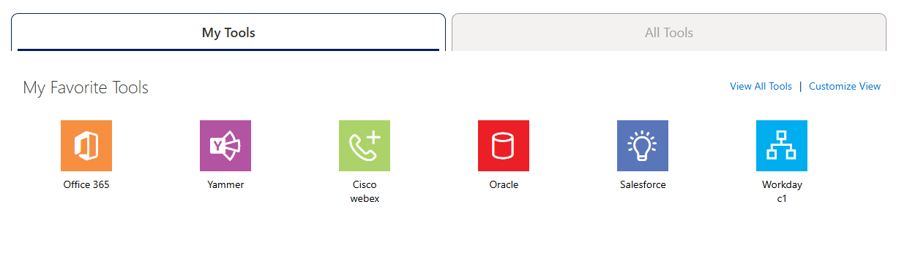
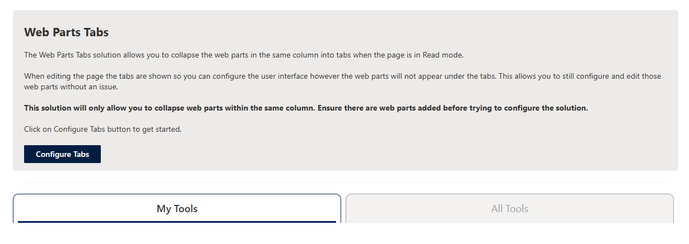

# Tabs (tabbed-webparts)

The Tabs web part allows you select web parts in the same section and render them under a tabbed ui when the page is in read mode.

Read Mode

 

Edit Mode

## Prerequisites

- None

## Quick Start - Use Solution

- Clone the repository
- Add the _tabbed-webparts.sppkg_ to the tenant or site collection app catalog
  - If not deployed globally, add the App to the site collection you would like to use it on
- Navigate to the page you would like to use it on
  - Edit the page
  - Add the Tabs web part to the page

## Quick Start - Development

- Clone the repository
- CD to the solution directory
- In the command line run
  - **npm install**
  - **gulp serve --nobrowser --max-old-space-size=8192**
- Navigate to a SharePoint page you would like to test the solution
  - append the following query string to the site _?debug=true&noredir=true&debugManifestsFile=https://localhost:4321/temp/manifests.js_
  - when prompted select _Load debug files_ button
- Edit the page
  - Add the Tabs web part to the page

## Features

The Tabs web part allows you render selected web parts in the same section with a tabbed UI when viewing the page in read mode. The solution modifies DOM elements on the page which makes it **NOT SUPPORTED BY MICROSOFT AND GOES AGAINST THEIR RECOMMENDATION ON NOT MODIFYING THE DOM OUTSIDE YOUR WEB PART**. Proceed with caution when using this web part, however if it fails to find the selected web part they will simply render in the order they appear when editing the page. Thus, in my opinion, I feel like the risk is worth it as the downside is a less than pleasant UI versus adverse functionality.

This web part illustrates the following concepts:

- Custom property pane controls
- React functional components
- Implementing site theme versus custom color options
- Deep linking to a web part and setting active tab
- Updating a web parts properties from a child component
- Modifying the UI (**NOT SUPPORTED BY MICROSOFT**)

## Solution

| Solution Name | Author(s)                 |
| ------------- | ------------------------- |
| Tabs          | Anthony Poulin (ynot3363) |

## Version history

| Version | Date              | Comments        |
| ------- | ----------------- | --------------- |
| 1.0     | December 18, 2024 | Initial release |

## Disclaimer

> **THIS CODE IS PROVIDED _AS IS_ WITHOUT WARRANTY OF ANY KIND, EITHER EXPRESS OR IMPLIED, INCLUDING ANY IMPLIED WARRANTIES OF FITNESS FOR A PARTICULAR PURPOSE, MERCHANTABILITY, OR NON-INFRINGEMENT.**
